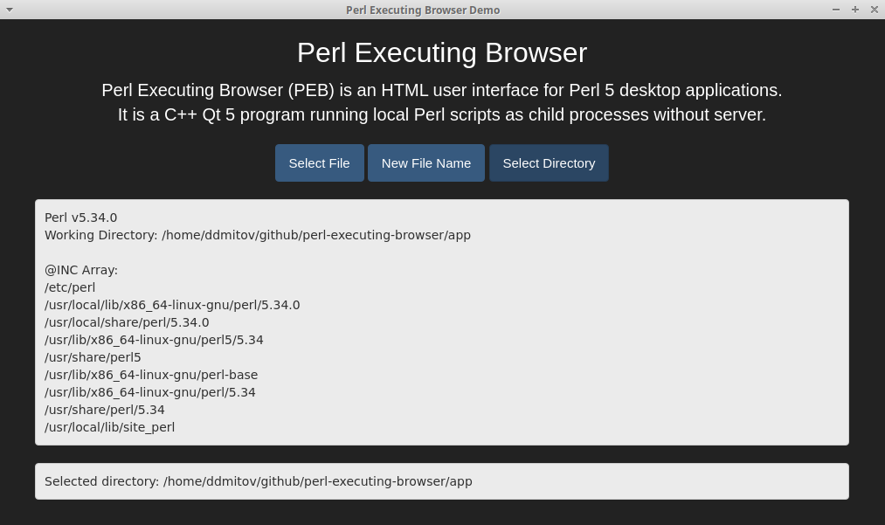

# Perl Executing Browser QtWebEngine

Perl Executing Browser (PEB) is an HTML user interface for [Perl 5](https://www.perl.org/) desktop applications.  
It is a C++ [Qt 5](https://www.qt.io/) program running local Perl scripts as child processes without server.  

  

## Contents

* [Design Objectives](#design-objectives)
* [Features](#features)
* [Requirements](#requirements)
* [Security](#security)
* [Limitations](#limitations)
* [Application Directory](./doc/application-directory.md)
* [Perl Scripts API](./doc/perl-scripts-api.md)
* [Ubuntu Package](#ubuntu-package)
* [Logging](#logging)
* [History](#history)
* [Thanks and Credits](./CREDITS.md)
* [License](./LICENSE.md)
* [Author](#author)

The key words "MUST", "MUST NOT", "REQUIRED", "SHALL", "SHALL NOT",  
"SHOULD", "SHOULD NOT", "RECOMMENDED", "MAY" and "OPTIONAL"  
in the documentation of this project are to be interpreted as described in [RFC 2119](https://www.ietf.org/rfc/rfc2119.txt).  

## Design Objectives

* **1. Easy graphical user interface for Perl 5 desktop applications**
* **2. Secure solution with no server process**
* **3. Maximal reuse of existing web technologies and standards**

## Features

* No limitation on how long a Perl script can run
* Any version of a [relocatable](https://github.com/skaji/relocatable-perl) or standard Perl 5 distribution can be used.
* [Output from Perl scripts is seamlessly inserted in a web-like user interface.](./doc/perl-scripts-api.md)
* [Local full paths can be selected and passed to Perl scripts.](./doc/perl-scripts-api.md)
* [Optional icon](./doc/application-directory.md)

## Requirements

### Compile-Time Requirements

* Qt development bundle versions 5.9 - 5.15

* QtWebEngine headers and libraries

Run the following commands in the root directory of the PEB project to compile PEB:

```bash
cd src
qmake -qt=qt5
make
```

### Runtime Requirements

* QtWebEngine 5.9 - 5.12 runtime libraries

* Perl 5 - any Linux [relocatable](https://github.com/skaji/relocatable-perl) or standard Perl distribution

  PEB will use the first Perl on PATH if a relocatable Perl distribution is not available.

## Security

* PEB does does not implement and does not use a server process.
* PEB Perl scripts are only local scripts executed with no sandbox.
* PEB does not access web content.

## Limitations

* No access to web content
* No Perl scripting inside frames
* No JavaScript Alert, Confirm and Prompt
* No pop-up windows
* Minimal context menu
* No printing
* No AppImage support

## [Application Directory](./doc/application-directory.md)

## [Perl Scripts API](./doc/perl-scripts-api.md)

## Ubuntu Package

PEB can be packed as an Ubuntu .deb package using the included ``makedeb.sh`` script.  
PEB can be installed from an Ubuntu .deb package using the command:  

```bash
sudo dpkg -i peb-*-x86_64.deb
```

When PEB is installed system-wide, it can be used as a runtime for PEB-based applications. In this scenario PEB must be started with a PEB Application Directory as its only command-line argument:  

```bash
peb /full/path/to/application-directory
peb ./relative/path/to/application-directory
```

## Logging

PEB has unified logging of all JavaScript and Perl errors in the command-line console.

## History

PEB was started in 2013 as a simple user interface for personal database applications.  
PEB QtWebEngine became a separate application in 2018.

## [Thanks and Credits](./CREDITS.md)

## [License](./LICENSE.md)

This program is free software;  
you can redistribute it and/or modify it under the terms of the GNU Lesser General Public License,  
as published by the Free Software Foundation;  
either version 3 of the License, or (at your option) any later version.  
This program is distributed in the hope that it will be useful, but WITHOUT ANY WARRANTY;  
without even the implied warranty of MERCHANTABILITY or FITNESS FOR A PARTICULAR PURPOSE.

## Author

Dimitar D. Mitov, 2018 - 2019, 2023
